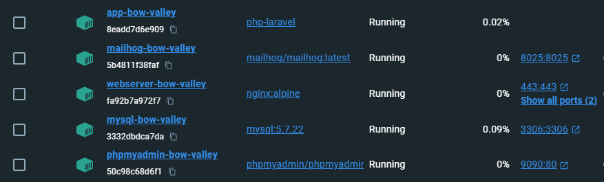

# Docker Compose

This Docker Compose setup provides a complete environment for Laravel application development, including PHP, Nginx, MySQL, Mailhog, and phpMyAdmin. Below are details about each service, access URLs, and credentials where applicable.

## Services

### PHP (app)

- **Description:** Custom PHP environment for Laravel development, configured with specific extensions and settings to optimize development.
- **Access URL:** Not directly applicable, used internally by the webserver service.
- **Credentials:** Not applicable.
- **Volumes:** Application code mapped to `/var/www`, along with specific PHP configuration files.

### Nginx (webserver)

- **Description:** Nginx web server configured to serve the Laravel application.
- **Access URL:** [http://localhost](http://localhost) for HTTP.
- **Credentials:** Not applicable.
- **Volumes:** Application code and specific Nginx configurations.

### Nginx (react server)

- **Description:** Nginx web server configured to serve the React application.
- **Access URL:** [http://localhost:8000](http://localhost:8000) for HTTP.
- **Credentials:** Not applicable.
- **Volumes:** Application code and specific Nginx configurations.

### MySQL (db)

- **Description:** MySQL database to store application data.
- **Access URL:** Host: `localhost`, Port: `3306`.
- **Credentials:** User: `db_user`, Password: `password`, Database: `bow-valley`.
- **Volumes:** Database data and custom configurations.

### Mailhog (mailhog)

- **Description:** Email capturing tool for testing email sending without sending to the real recipient.
- **Access URL:** [http://localhost:8025](http://localhost:8025).
- **Credentials:** Not applicable.

### phpMyAdmin (phpmyadmin)

- **Description:** Web interface for managing the MySQL database.
- **Access URL:** [http://localhost:9090](http://localhost:9090).
- **Credentials:** Same as MySQL service.

## Networks

- **bow-valley_network:** Bridge network for communication between services.

## Volumes

- **dbdata:** Persistent data for MySQL.

## Additional Instructions

To start all services, ensure Docker and Docker Compose are installed on your machine and run the following command in your project directory:

```bash
docker-compose up -d
```

To stop and remove all containers, networks, and volumes defined by the Compose, run:

```bash
docker-compose down -v
```

This Docker environment is ideal for local Laravel application development, providing all necessary services for an efficient workflow.


## Docker Environment Screenshot

Below is a screenshot from Docker Desktop showing the running containers for each service defined in the Docker Compose file. This visual representation helps in monitoring the status and health of each container involved in the development environment.


